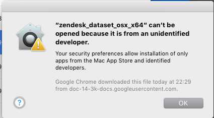
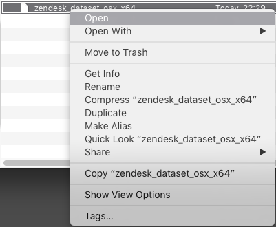
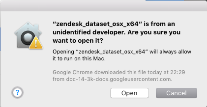
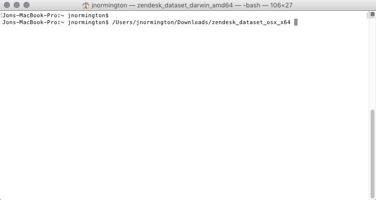
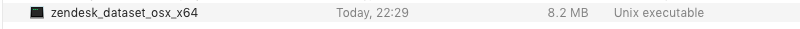
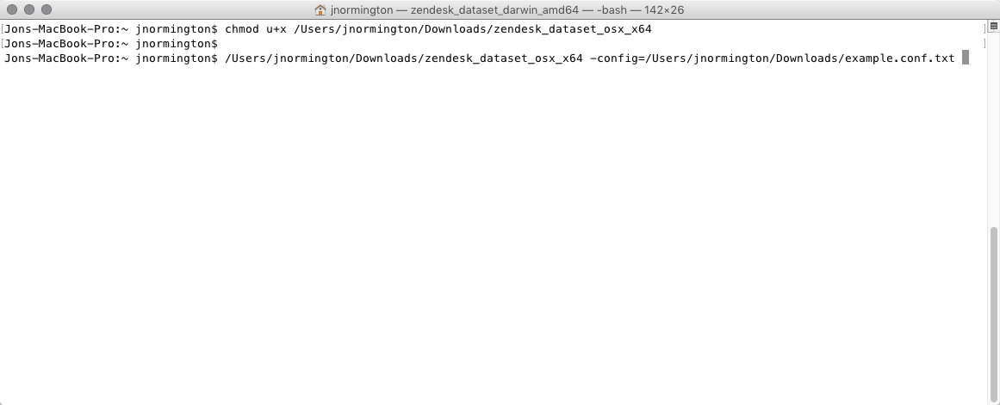
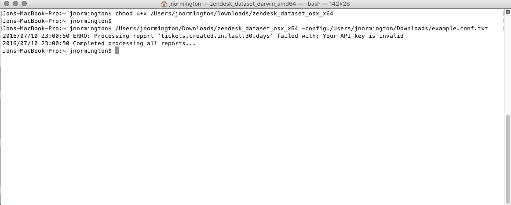

# Mac OSX Setup

First you need to download the zendesk dataset program.

* [OSX program](https://github.com/geckoboard/zendesk_dataset/releases/download/v0.1.0/zendesk_dataset_osx_x64)

## Downloading an example configuration file

To get you started with a template config file [download this file](example.conf) this will
be used later to ensure that you are ready to start modifying it later on.

## Approving the app to run

When you have downloaded the program you will need to whitelist it, as being ok. To check this
double click the file that just downloaded. It should display the following



Press OK and then right click on the file and select Open



In doing this we get a different prompt to approve the app like below



Click Open on this dialog and it will open it with TextEdit. Now close TextEdit as it will be used
in terminal.

## Making the file executable

Currently the file is not executable and needs to be changed to be executable so that it will run.


* Open Terminal
* Open Finder (with where you downloaded the zendesk dataset file)
* Drag the file into the terminal window it should look like the following



Now in terminal where the file path to the zendesk dataset we need to prefix it with `chmod u+x `

So based on the image above with the path the command would look like the following

 ```sh
 chmod u+x /Users/jnormington/Downloads/zendesk_dataset_osx_x64
 ```

Press Return(Enter) key on the keyboard and if done correctly will output nothing and start a
newline for a new command to be written.

Also in finder the application kind will change to unix executable and will show the icon as a
terminal icon like below



## Running the program

In the same terminal window from previously drag in the file into terminal again.

Then append it with ` -config=` at the end of the file path of the zendesk dataset file path

Now drag in the example.conf file that we downloaded earlier. It should look like the following



You're display might be over two lines this is perfectly normal and fine.

Now we are ready to press the Return(Enter) key on the keyboard. If everything is correctly
completed you should see the following output.



This means that it attempted to make a request for the tickets in the last 30 days from zendesk
but our API key isn't valid. This is correct because both the Zendesk and Geckoboard API keys
are just dummy entries as an example.

Now you are ready to continue onto step 2 in the
[getting started](getting_started.md#modifying-the-configuration-file) doc.
