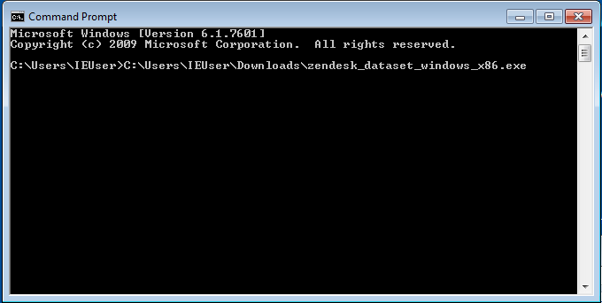

# Windows Setup

First you need to ensure to download the correct binary for your hardware.
If you are not sure which version to download just select the 32-bit version.

* [Windows 32-bit exe file](https://github.com/geckoboard/zendesk_dataset/releases/download/v0.1.0/zendesk_dataset_windows_x86.exe)
* [Windows 64-bit exe file](https://github.com/geckoboard/zendesk_dataset/releases/download/v0.1.0/zendesk_dataset_windows_x64.exe)

When downloading the executable file you may get some red warnings such as the following

##### Upon downloading the file in IE

##### When attempting to run the executable

Unfortunately this is expected as the executable files are not signed for windows to authenticate.

## Downloading an example configuration file

To get you started with a template config file [download this file](example.conf) this will
be used later to ensure that you are ready to start modifying it later on.

## Running the program

Unfortunately this is command line app and therefore requires using command prompt. Some IT admins
might have disabled this for which we are unable to help, but if this isn't the case then;

* Click on the Start menu
* Click on All Programs
* Select Accessories
* Find command prompt in the list

Alternatively you can use the windows search bar to find command prompt by typing `command` and wait
for it to appear

Once command prompt is open, find where you downloaded the file and drag it into the command prompt
window you should end up with the full file path to the zendesk dataset executable file.

Now type the following `-config=` with a space after path of the executable and also now drag
the example.conf file that we downloaded earlier on. It should look something similar to below

You're display might be over two lines this is perfectly normal and fine.

Now we are ready to press the Return(Enter) key on the keyboard. If everything is correctly
completed you should see the following output.

This means that it attempted to make a request for the tickets in the last 30 days from zendesk
but our API key isn't valid. This is correct because both the Zendesk and Geckoboard API keys
are just dummy entries as an example.

Now you are ready to continue onto step 2 in the
[getting started](getting_started.md#modifying-the-configuration-file) doc.
